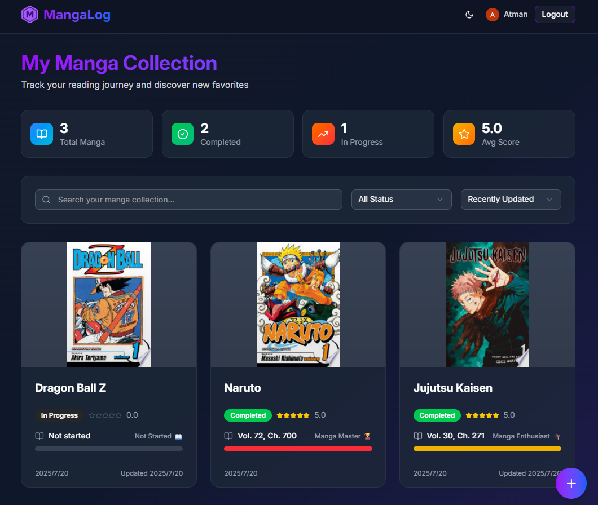

<div align="center">
  
</div>

# MangaLog

A modern web application for tracking your manga reading progress. Built with React Router v7 and Cloudflare for a fast, reliable experience.

## About

MangaLog is a personal manga library application that helps you:
- **Track Reading Progress**: Log volumes and chapters you've read
- **Rate & Review**: Score manga from 0-5 stars and add personal notes
- **Organize Collection**: Search, sort, and manage your manga library
- **Mark Completion**: Track which series you've finished reading

## Features

### Core Functionality
- 📚 **Personal Manga Library**: Add, edit, and delete manga entries
- 📊 **Progress Tracking**: Track volume and chapter progress with visual progress bars
- ⭐ **Rating System**: Score manga from 0.0 to 5.0 stars with visual star ratings
- 📝 **Personal Notes**: Add custom notes for each manga
- ✅ **Completion Status**: Mark series as completed or ongoing
- 🔍 **Advanced Search & Filter**: Find manga by title and filter by completion status
- 🔄 **Smart Sorting**: Sort by date updated, score, or title alphabetically
- 📈 **Collection Statistics**: View total manga, completed series, in-progress titles, and average score
- 🏆 **Reading Achievements**: Progress badges based on volume milestones (Quick Reader → Manga Master)

### Google Books Integration
- 🔍 **Auto-Complete Search**: Search Google Books API for manga titles
- 🖼️ **Cover Image Support**: Automatically fetch and display manga cover thumbnails
- 📖 **Smart Filtering**: Results filtered to show only Comics & Graphic Novels category
- ⚡ **One-Click Import**: Select from search results to auto-fill title and cover image

### Technical Features
- 🚀 **Server-Side Rendering**: Fast initial page loads
- 📱 **Responsive Design**: Works on mobile and desktop with optimized layouts
- 🔐 **Google OAuth**: Secure authentication
- ⚡ **Edge Computing**: Powered by Cloudflare Workers
- 🎨 **Modern UI**: Built with Tailwind CSS and shadcn/ui components
- 🌙 **Dark Mode Support**: Automatic theme switching with next-themes

## Tech Stack

- **Frontend**: [React 19](https://react.dev/), [React Router v7](https://reactrouter.com/)
- **Backend**: [Cloudflare Workers](https://workers.cloudflare.com/), [Cloudflare Pages](https://pages.cloudflare.com/)
- **Database**: [Cloudflare D1](https://developers.cloudflare.com/d1/) (SQLite)
- **ORM**: [Drizzle ORM](https://orm.drizzle.team/)
- **Authentication**: [better-auth](https://www.better-auth.com/) with Google OAuth
- **State Management**: [Zustand](https://zustand-demo.pmnd.rs/)
- **UI/Styling**: [Tailwind CSS v4](https://tailwindcss.com/), [shadcn/ui](https://ui.shadcn.com/)
- **Build Tools**: [Vite](https://vitejs.dev/), [TypeScript](https://www.typescriptlang.org/)
- **Code Quality**: [Biome](https://biomejs.dev/), [Vitest](https://vitest.dev/)

## Getting Started

### Prerequisites

- Node.js 18+ and npm
- A Cloudflare account for deployment

### 1. Installation

Clone the repository and install dependencies:

```bash
git clone <repository-url>
cd manga-log
npm install
```

### 2. Environment Variables

Copy the example environment file and configure your settings:

```bash
cp .env.example .dev.vars
cp .env.example .env
```

Required environment variables:
- `BETTER_AUTH_SECRET`: A secure random string for auth encryption
- `GOOGLE_CLIENT_ID`: Your Google OAuth client ID
- `GOOGLE_CLIENT_SECRET`: Your Google OAuth client secret
- `BETTER_AUTH_URL`: Your application URL (http://localhost:5173 for development)

### 3. Google OAuth Setup

1. Go to the [Google Cloud Console](https://console.cloud.google.com/)
2. Create a new project or select an existing one
3. Enable the Google+ API
4. Create OAuth 2.0 credentials
5. Add your domain to authorized origins
6. Add the callback URL: `{your-domain}/api/auth/callback/google`

### 4. Database Setup

Initialize your local D1 database:

```bash
# Generate the auth schema
npm run auth:db:generate

# Apply database migrations
npm run db:migrate
```

### 5. Start Development

Start the development server:

```bash
npm run dev
```

Your application will be available at `http://localhost:5173`.

## Usage

### Getting Started with MangaLog

1. **Sign In**: Click "Login" and authenticate with your Google account
2. **Add Your First Manga**: Click the "+" button to add a new manga entry
3. **Track Progress**: Update volume/chapter progress as you read
4. **Rate & Review**: Give scores and add personal notes
5. **Organize**: Use search and sorting to manage your collection

### Manga Entry Fields

- **Title** (required): The name of the manga series
- **Score** (optional): Rating from 1.0 to 5.0 stars
- **Completion Status**: Mark as completed or ongoing
- **Volume Progress**: Last volume number read
- **Chapter Progress**: Last chapter number read
- **Personal Notes**: Your thoughts and comments

## Available Scripts

- `dev`: Start development server with hot reload
- `build`: Create production build
- `preview`: Preview production build locally
- `deploy`: Deploy to Cloudflare Pages
- `db:generate`: Generate database migration files
- `db:migrate`: Apply migrations to local database
- `db:migrate-production`: Apply migrations to production database
- `auth:db:generate`: Generate authentication schema
- `check`: Run type checking and linting
- `biome:check`: Format and lint code
- `test`: Run test suite

## Deployment

### 1. Create Production Database

Create a D1 database in your Cloudflare dashboard:

```bash
npx wrangler d1 create manga-log-db
```

### 2. Configure Wrangler

Update `wrangler.jsonc` with your database details:

```jsonc
{
  "d1_databases": [
    {
      "binding": "DB",
      "database_name": "manga-log-db",
      "database_id": "your-database-id"
    }
  ]
}
```

### 3. Set Environment Variables

In your Cloudflare dashboard, add the same environment variables from your `.env` file to your Pages project.

### 4. Run Production Migrations

```bash
npm run db:migrate-production
```

### 5. Deploy

```bash
npm run deploy
```

## Project Structure

```
manga-log/
├── app/
│   ├── components/          # Shared UI components
│   ├── lib/                # Utilities and configurations
│   ├── routes/             # File-based routing
│   │   ├── _app/           # Authenticated app layout
│   │   ├── _landing/       # Landing page layout
│   │   └── api.auth.$/     # Authentication endpoints
│   └── styles/             # Global styles
├── database/               # Database schema and migrations
├── public/                 # Static assets
└── workers/               # Cloudflare Workers code
```

## Authentication

manga-log uses Google OAuth for secure authentication:

- **Provider**: Google OAuth 2.0 only
- **Session Management**: Secure HTTP-only cookies
- **Route Protection**: All manga features require authentication
- **User Isolation**: Each user can only access their own manga data

Key authentication files:
- `auth.ts`: Main better-auth configuration
- `app/lib/auth/auth.server.ts`: Server-side auth utilities
- `app/lib/auth/auth-client.ts`: Client-side auth utilities

## Database Schema

The MangaLog database includes:

### manga_logs table
- `id`: Primary key (text)
- `title`: Manga title (required)
- `thumbnail`: Cover image URL from Google Books API (optional, text)
- `score`: Rating from 1.0-5.0 (optional, real number)
- `is_completed`: Completion status (boolean, defaults to false)
- `volume_progress`: Last volume read (optional, integer)
- `chapter_progress`: Last chapter read, supports decimals (optional, real number)
- `note`: Personal notes (optional, text)
- `user_id`: Foreign key to user (text)
- `created_at`: Creation timestamp (text)
- `updated_at`: Last update timestamp (text)

### Authentication Tables
The application uses better-auth which automatically manages:
- `user`: User profiles and Google OAuth data
- `session`: Active user sessions
- `account`: OAuth account linking
- `verification`: Email verification tokens

## Contributing

1. Fork the repository
2. Create a feature branch
3. Make your changes
4. Run tests and linting: `npm run check`
5. Submit a pull request

## License

This project is licensed under the MIT License.

---

Built with ❤️ for manga enthusiasts using React Router and Cloudflare.