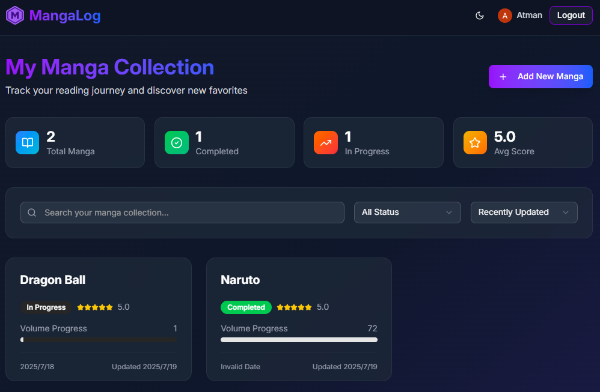
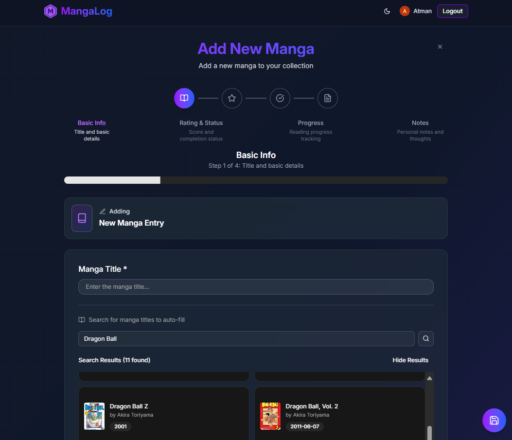

# MangaLog: The Manga Tracking App for Every Reader

*Finally, a dedicated app to organize your manga collection and never lose track of your reading progress*

[MangaLog - Your Personal Manga Companion - MangaLog](https://mangalogs.com/)

---

## The Problem: Keeping Track of Your Manga Journey

As a manga enthusiast, I faced a common problem: keeping track of what I've read, where I left off, and what I thought about each series. With hundreds of ongoing series and completed works, it's easy to lose track of your reading progress.

Existing solutions felt either too complex, too generic, or lacked the specific features manga readers need. So I decided to build **MangaLog** - a dedicated manga tracking application that's both powerful and simple to use.

## What is MangaLog?

MangaLog is a modern web application designed specifically for manga readers to:

- **Track reading progress** with volume and chapter numbers
- **Rate and review** series with a 5-star system and personal notes
- **Organize collections** with smart search and sorting
- **Mark completion status** for finished series
- **View reading statistics** and achievement badges
- **Auto-import manga data** from Google Books API

The app is built with modern web technologies for lightning-fast performance and a smooth user experience.

## Key Features That Make MangaLog Special

### 1. Google Books Integration

One of the standout features is the Google Books API integration. When adding a new manga, users can search and auto-import:

- Manga titles
- Cover images
- Metadata

This eliminates manual data entry and ensures consistent formatting.

The search feature makes it incredibly easy to find and add manga to your collection with just a few clicks.

### 2. Smart Progress Tracking

MangaLog supports both volume and chapter progress with decimal precision. For example, you can track that you're on volume 15, chapter 142.5 of a series. Visual progress bars show your reading completion at a glance, making it easy to see how far you've come.

### 3. Achievement System

Gamification elements keep users engaged:

- **Quick Reader**: 10+ volumes read
- **Dedicated Fan**: 50+ volumes read  
- **Manga Master**: 100+ volumes read

### 4. Advanced Filtering and Search

Users can filter by:
- Completion status
- Score ranges
- Reading progress
- Custom text search

## Simple and Secure Login

MangaLog uses Google OAuth for authentication, which means:
- **One-click login** with your Google account
- **Secure data protection** - your manga data is private and belongs only to you
- **No password management** - use your existing Google account
- **Cross-device sync** - access your collection from any device

## Lightning-Fast Performance

The app is built for speed and reliability:
- **Global performance** - fast loading times worldwide
- **Instant updates** - changes appear immediately as you use the app
- **Optimized images** - manga cover images load quickly and look great
- **Works offline** - basic functionality available even without internet

## Why MangaLog Stands Out

### Built Specifically for Manga Readers

Unlike generic book tracking apps, MangaLog understands manga:
- **Volume and chapter tracking** - perfect for ongoing series
- **Decimal chapter support** - track partial chapters (like 142.5)
- **Completion status** - distinguish between ongoing and finished series
- **Visual progress indicators** - see your reading progress at a glance

### Smart Organization Features

- **Intelligent search** - find any manga in your collection instantly
- **Multiple sorting options** - by date, score, or title
- **Filter by status** - view only completed series or ongoing reads
- **Reading statistics** - see your total volumes read and average scores

## What's Next?

Future enhancements planned for MangaLog:

- **Social features**: Share reading lists with friends
- **Reading recommendations**: AI-powered suggestions
- **Mobile app**: React Native version
- **Import/export**: Backup and migration tools
- **Reading statistics**: Advanced analytics and insights

## Try MangaLog Today

Ready to organize your manga collection? Here's how to get started:

### 🚀 **[Try MangaLog Now - Free Web App](https://mangalogs.com)**

No installation required! Just visit the link above and sign in with your Google account to start tracking your manga immediately.

### 📚 **For Developers**

MangaLog is open source and available on GitHub:

- **[View Source Code](https://github.com/atman-33/manga-log)** - Explore the codebase
- **Self-host**: Deploy your own instance
- **Contribute**: Help improve the project with new features

The application is completely free to use and respects user privacy - your manga data belongs to you and is never shared with third parties.

## Conclusion

Building MangaLog has been an incredible journey focused on creating the perfect tool for manga enthusiasts. The app combines powerful features with a simple, intuitive design that makes tracking your manga collection effortless and enjoyable.

Whether you're just starting your manga journey or you're a seasoned reader with hundreds of series under your belt, MangaLog is designed to grow with your collection and enhance your reading experience.

---

*What manga are you currently reading? Try MangaLog and let me know what you think!*

**Tags**: #Manga #Reading #Organization #Tracking #Collection #Anime #Books

---

*Follow me for more posts about manga, reading, and useful apps for book lovers.*